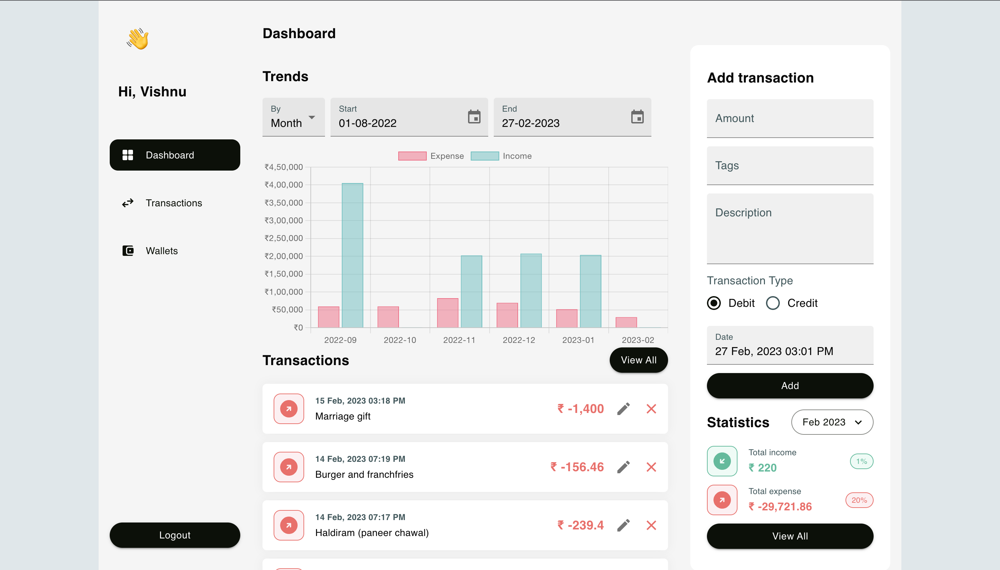

# Budget manager

A budget management web-app

## Techstack

- Docker & Docker compose
- Nginx
- Mongodb
- Nodejs
- Reactjs

## Running project locally

- Copy all sample `.env` files to create corresponding `.env` files in `<project-root>/env` directory
- run `docker compose -f docker-compose.dev.yaml build` to build the images
- run `docker compose -f docker-compose.dev.yaml up` to start the application
- visit `http://localhost`
- use `$APP_USERNAME` and `$APP_PASSWORD` as you login credentials from `backend.env` file

## Screenshots

Dashboard

Edit transaction screen

